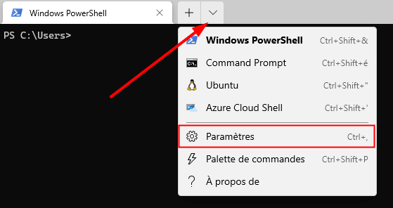
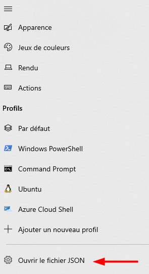
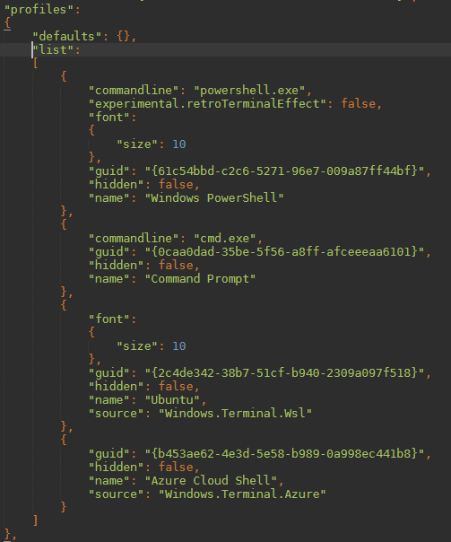

# gitbash_in_cmd

Pour ajouter Git Bash à la liste des profils, ouvrez Windows Terminal et ouvrez la fenêtre des paramètres depuis la flèche située en haut :

Vous pouvez aussi y accéder en faisant CTRL+, ou en utilisant la palette (CTRL+SHIFT+P) et en recherchant "paramètres".

Dans la partie gauche des paramètres, vous pouvez apercevoir les différents profils existants. Pour ma part :

- Windows PowerShell
- Command Prompt
- Ubuntu
- Azure Cloud Shell

Il n'est pas possible d'ajouter simplement Git Bash à cette liste. Pour cela, cliquez sur "Ouvrir le fichier JSON" :

Ce fichier contient la configuration de votre Windows Terminal au format JSON. Repérez l'entrée "profiles": puis "list": :

puis rajouté le code.